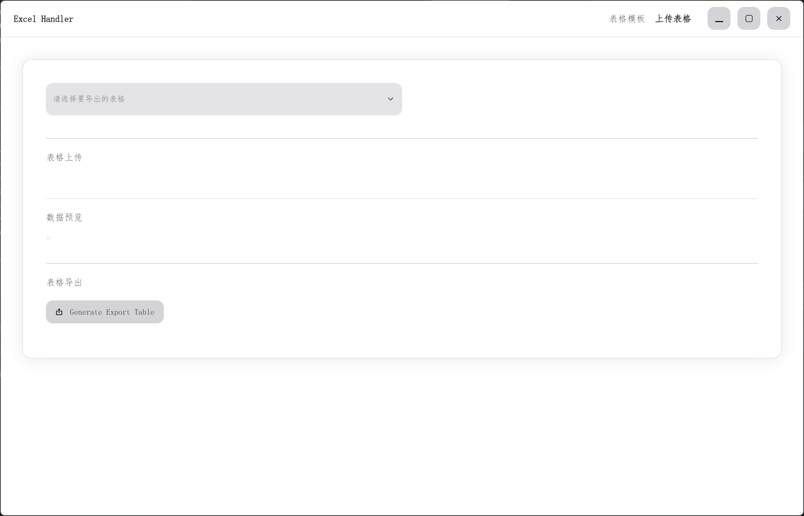

<div style="display: flex;flex-flow: column;align-items: center">
<h4>Excel Handler</h4>
<span style="margin-bottom: 10px;font-weight: bold">
💼 使用JavaScript快速编辑表格的可视化客户端
</span>

</div>

### Start Project

install project dependencies

```shell
$ npm i
```

start in development environment

```shell
$ npm run start
```

---

### Package as an installer

build as html static files

```shell
$ npm run build
```

package a windows 64-bit installer

```shell
$ npm run pak-win-x64
```

package a windows 32-bit installer

```shell
$ npm run pak-win-ia32
```

---

### User Guide

Please stay tuned.


